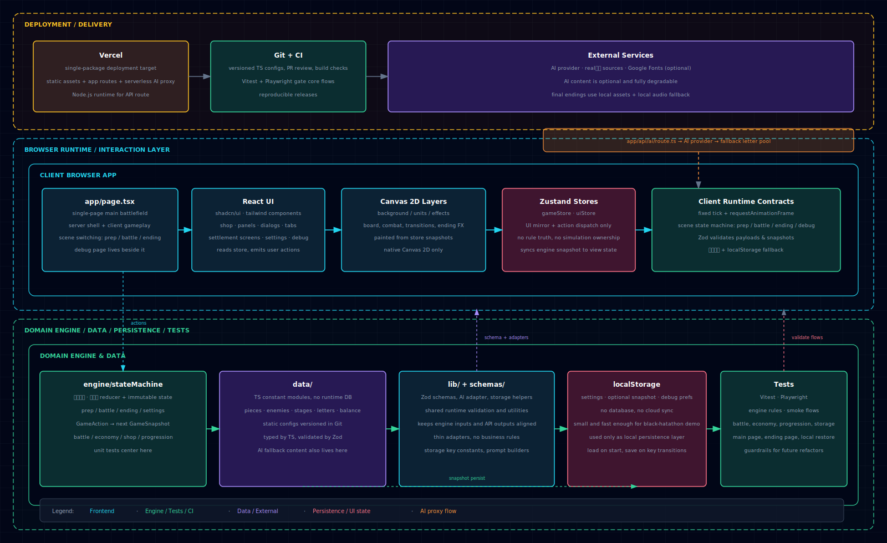
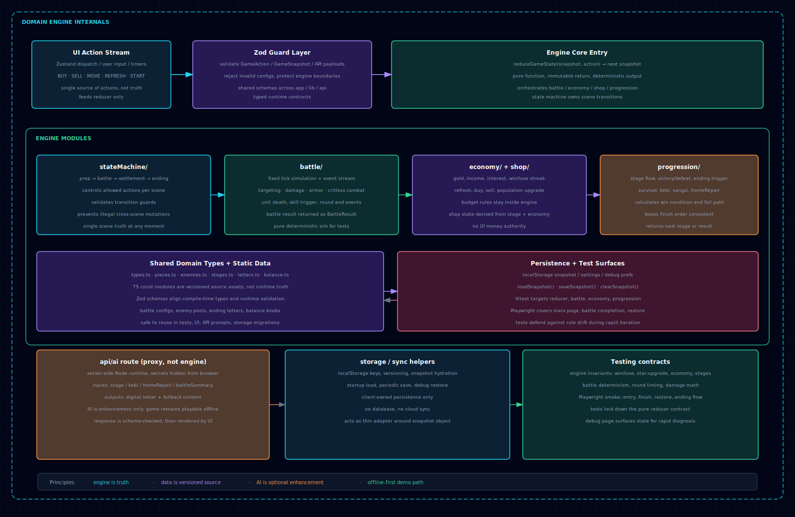
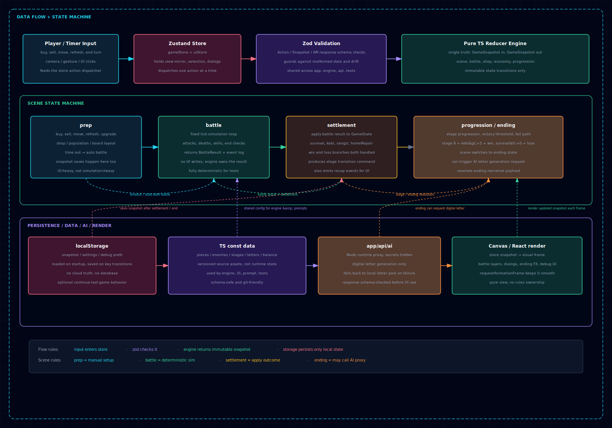

# 《客批》架构与技术栈方案 v1

> 依据：[PRD V1.6](kepi_PRD_V1.6.md) · [数据结构清单 v1](kepi_data-structures_v1.md) · [目录职责与核心接口清单 v1](kepi_directory-responsibilities-and-core-interfaces_v1.md)
> 目标：把项目的技术栈、分层方式、数据流与目录边界一次定清楚，方便后续直接开工
> 更新：2026-06-25 — 对齐三张架构图、补充状态机四态与 Demo 部署策略

## 0. 相关文档

| 文档 | 用途 |
|---|---|
| [kepi_PRD_V1.6.md](kepi_PRD_V1.6.md) | 产品规则与数值口径 |
| [kepi_data-structures_v1.md](kepi_data-structures_v1.md) | 字段、初始值、状态机判定 |
| [kepi_directory-responsibilities-and-core-interfaces_v1.md](kepi_directory-responsibilities-and-core-interfaces_v1.md) | 目录职责、核心类型与 API 约定 |
| [kepi_architecture-overview_v1.svg](assets/kepi_architecture-overview_v1.svg) | 全链路架构总览 |
| [kepi_engine-internal-architecture_v1.svg](assets/kepi_engine-internal-architecture_v1.svg) | 引擎内部分模块 |
| [kepi_data-flow-and-state-machine_v1.svg](assets/kepi_data-flow-and-state-machine_v1.svg) | 数据流与场景状态机 |

## 1. 结论先行

本项目采用以下方案：

- `Next.js` + `App Router`
- `TypeScript`
- `Tailwind CSS` + `CSS Variables`
- `shadcn/ui`
- `Zustand`
- 原生 `Canvas 2D`
- 纯 `TS reducer` 引擎
- `Zod`
- `localStorage`
- `Vitest`
- `Playwright`
- `app/api/*` 代理 AI
- 单包应用，Demo 优先部署到 **EdgeOne Pages** 或 **Cloudflare Pages**
- 断网可完整玩（AI 降级到本地文案池）
- 单页主战场 + 场景状态切换

核心原则：

- 规则只认 `engine`
- 展示只认 `store`
- 配置只认 `data`
- AI 只走 `api`
- 存档只走 `localStorage`

## 2. 架构目标

### 2.1 为什么这样切

本项目是黑客松节奏，核心目标不是搭一个复杂平台，而是稳定交付一局完整、可演示、可讲故事的自走棋体验。

因此架构优先级是：

1. 主流程稳定
2. 数值可控
3. AI 可降级
4. 结局表现力强
5. 开发和调试足够快

### 2.2 设计原则

- 纯前端可运行，减少部署和依赖成本
- 引擎与 UI 解耦，便于测试和调数值
- 静态配置与运行时状态分离
- AI 作为增强项，不是主流程单点故障
- 所有关键规则都有本地兜底

### 2.3 架构图总览

#### 2.3.1 架构总览图



#### 2.3.2 引擎内部架构图



#### 2.3.3 数据流与状态机图



## 3. 总体分层

上面的三张图分别对应：

- **架构总览**：从部署、前端、引擎、数据、存档、AI 到测试的全链路
- **引擎内部**：纯 TS reducer 内部如何拆分子模块
- **数据流与状态机**：一局游戏从输入到结局的完整流转

### 3.1 层职责

#### `app/`

- 路由入口
- 页面壳子
- `app/api/*` 的 AI 代理
- 外层使用 Server Component
- 游戏主体使用 Client Component

#### `engine/`

- 纯 TypeScript 游戏规则引擎
- 唯一真相
- 负责：
  - 战斗
  - 经济
  - 商店
  - 关卡推进
  - 场景状态机
  - 升星
  - 公益后勤（水客收信 / 乡贤修家园）
  - 结算
  - 胜负判定

#### `store/`

- Zustand 状态仓库
- 只做 UI 镜像和 action 分发
- 不承载规则真相

#### `data/`

- 棋子配置
- 敌人配置
- 数值表
- 文案
- 结局信件
- 关卡池
- AI 降级文案池
- 全部为 `TypeScript` 常量模块

#### `components/`

- React UI
- 商店
- 面板
- 弹窗
- 调试页
- Canvas 容器

#### `lib/`

- 通用工具
- `Zod` schema
- 存档读写
- AI 请求封装
- 数据适配

#### `public/`

- 图片
- 音频
- 结局素材

## 4. 数据流

### 4.1 核心循环

1. 玩家在 UI 上操作
2. Zustand 接收 action
3. `Zod` 校验 action 载荷
4. 纯 TS 引擎 reducer 计算下一份不可变 snapshot
5. Zustand 更新镜像状态
6. React / Canvas 重新渲染
7. 关键快照写入 `localStorage`

**不变式**：引擎只接收合法动作；入参 snapshot 不被原地修改；UI 不直接改业务字段。

### 4.2 场景状态机

一局游戏按四个场景流转（详见 [数据结构清单 §6](kepi_data-structures_v1.md)）：

| 场景 | 职责 | 玩家操作 |
|---|---|---|
| `prep` | 备战：买棋、布阵、升人口、刷新商店 | 手动操作 |
| `battle` | 战斗：固定 tick 确定性模拟 | 观看 |
| `settlement` | 结算：推进 `kebi` / `survival` / `sangzi` / `homeRepair` | 确认后继续 |
| `ending` | 结局：归乡或救信，可触发 AI 数字客批 | 手势 / 阅读 |

流转规则：

```
prep → START_BATTLE → battle → END_BATTLE → settlement
settlement → (未结束) → prep
settlement → (result = win/lose) → ending
```

### 4.3 双线资源流

PRD 要求两条独立数值线，引擎必须解耦处理：

- **生存线**：`survival`（输关 −1，归零提前出局）
- **主线**：`kebi`（纯胜场计数，每赢一关 +1，达 5 触发归乡票）
- **温情线**：`sangzi` → `homeRepair`（水客收信带回，乡贤建设，只升不降）

`kebi` 与 `sangzi` 同源（赢关）但口径独立，任何加成只放大 `sangzi`，不得改 `kebi`。

### 4.4 AI 流程

1. 前端调用 `POST /api/ai`
2. Route Handler 在服务端代理第三方 AI
3. AI 只负责"数字客批"等文案增强（flavor，不作结局朗读主体）
4. 若 AI 失败，Route 或前端切 `data/letters.ts` 预置文案池

### 4.5 存档流程

- 本局运行态：内存
- 设置项：`localStorage`（`kepi.settings`）
- 可选续局快照：`localStorage`（`kepi.snapshot`）
- 不引入数据库

## 5. 目录结构建议

```txt
src/
  app/
    layout.tsx
    page.tsx
    api/
      ai/
        route.ts
    debug/
      page.tsx
  components/
    game/
    ui/
  engine/
    battle/
    economy/
    shop/
    progression/
    stateMachine/
    support/          # 水客收信、乡贤修家园
    types.ts
    index.ts
  store/
    gameStore.ts
    uiStore.ts
  data/
    pieces.ts
    enemies.ts
    stages.ts
    letters.ts        # 真实侨批 + AI 降级文案池
    balance.ts
  lib/
    schemas/
    storage/
    ai/
    utils/
  types/
  styles/
public/
  images/
  audio/
```

接口与类型细节见 [目录职责与核心接口清单](kepi_directory-responsibilities-and-core-interfaces_v1.md)。

## 6. 模块边界

### 6.1 `engine`

建议按领域拆模块：

- `stateMachine`：prep / battle / settlement / ending / settings
- `battle`：战斗模拟、伤害、攻速、技能触发
- `economy`：金币、利息、工资、连胜连败
- `shop`：商店刷新、购买、卖出、人口
- `progression`：关卡推进、胜负判定、结局切换
- `support`：水客收信（`kebi` + `sangzi`）、乡贤修家园（`homeRepair`）

### 6.2 `store`

建议拆成两份：

- `gameStore`：对局镜像、操作分发、快照恢复
- `uiStore`：弹窗、面板、设置、调试态、手势/摄像头状态

### 6.3 `data`

建议全部采用 `as const` 的 TS 常量模块：

- 字段可被类型推导
- 编译期即可发现拼写错误
- 配置更容易互相引用
- 方便做 `Zod` 运行时校验

## 7. 关键技术决定

### 7.1 状态真相

- 纯 TS 引擎是唯一真相
- Zustand 只是 UI 镜像和操作入口
- `GameSnapshot` 结构见 [数据结构清单](kepi_data-structures_v1.md)

### 7.2 运行时节奏

- 固定 tick 负责战斗模拟
- `requestAnimationFrame` 负责绘制

### 7.3 渲染方式

- 外层 UI：React
- 棋盘与战斗：原生 Canvas 2D
- Canvas 建议分层：
  - 背景层（含土楼三阶段视觉）
  - 棋子与战斗层
  - 特效覆盖层

### 7.4 样式方案

- `Tailwind CSS`
- `CSS Variables` 管主题、土楼阶段色、敌我区分
- `shadcn/ui` 负责基础交互组件

### 7.5 AI 策略

- AI 不参与难度决策
- 难度由规则引擎控制
- 模型只负责数字客批文案
- AI 通过 `app/api/*` 代理
- `Node.js runtime`
- 失败时 Route 返回 `fallback` 字段，前端无感切换

### 7.6 存储策略

- 静态配置：源码内 `data/`
- 玩家存档：`localStorage`
- 不上数据库

### 7.7 部署策略（Demo）

本项目是路演 Demo，不备案，面向国内评委优先：

| 优先级 | 平台 | 说明 |
|---|---|---|
| **首选** | EdgeOne Pages | 国内节点，默认子域名免备案，Next.js 支持良好 |
| **备选** | Cloudflare Pages | 免费，国内比 Vercel 稳定，`@cloudflare/next-on-pages` 或静态导出 |
| **开发** | Vercel | 开发联调方便，但 `*.vercel.app` 国内不稳定，不作为路演主链 |

约束：

- 核心玩法必须 **offline-capable**（断网可完整跑一局，AI 走本地池）
- 若使用 SSR / API Route，部署平台需支持 Node runtime 或 Edge runtime
- 路演现场准备本地运行 / 录屏兜底

## 8. 测试策略

### 8.1 单元测试

用 `Vitest` 测纯 TS 引擎，重点覆盖：

- 胜负判定（`survival` / `kebi` / 末关顺序）
- 升星规则
- 经济结算
- 关卡推进
- 桑梓值流转
- 家园修复值推进（只升不降）
- `kebi` 与 `sangzi` 解耦不变式

### 8.2 冒烟测试

用 `Playwright` 覆盖关键路径：

- 开局进入对局
- prep → battle → settlement 完整循环
- 完整打一局到结局
- 本机存档恢复
- 结局页基础交互
- AI 失败时降级文案正常展示

## 9. 页面策略

- 单页主战场
- 通过场景状态机切换 prep / battle / settlement / ending / settings
- 不拆成多路由主流程
- 保留一个轻量 `debug/page.tsx` 调试页

## 10. 推荐实现顺序

1. 搭 Next.js 项目骨架
2. 落 `types.ts` 和 `data/` 最小结构
3. 实现 `stateMachine` + `progression`（胜负判定先于渲染）
4. 补 `battle` / `economy` / `shop` / `support`
5. 接入 Zustand 镜像层 + `Zod` 校验
6. 接入 Canvas 渲染
7. 接入 `localStorage`
8. 接入 `app/api/ai` + 降级文案池
9. 补 `Vitest` 和 `Playwright`
10. 做调试页和结局页

## 11. 当前约束清单

- 单包应用
- 无数据库
- 断网可玩
- AI 可降级
- `src/data` 只放静态配置，不放运行时真相
- `localStorage` 只放本机状态，不做服务端同步
- 引擎逻辑不写进组件
- 组件不直接改业务规则
- 结局正式朗读用真实馆藏侨批，AI 文本仅作沿途 flavor

## 12. 待确认项

以下已在 [目录职责与核心接口清单](kepi_directory-responsibilities-and-core-interfaces_v1.md) 中定稿，可直接开工：

- [x] 核心目录命名与职责
- [x] `GameState` / `GameSnapshot` / `GameAction` 结构
- [x] `POST /api/ai` 请求响应约定
- [x] `localStorage` key 命名

仍待产品 / 美术拍板：

- [ ] 结局页手势交互细节（MediaPipe / 简单 click 兜底）
- [ ] 调试页展示项清单
- [ ] AI prompt 模板与 token 预算
- [ ] 土楼三阶段部位级视觉资源清单
